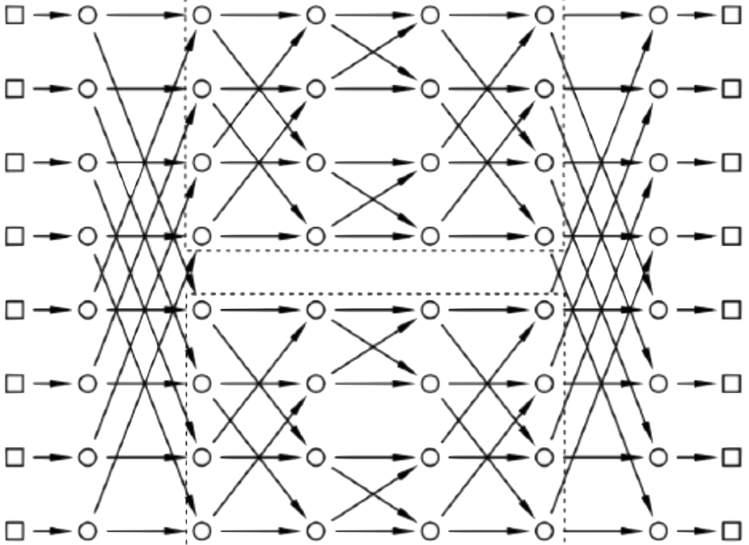

# BitPermutations.jl
Efficient routines for repeated bit permutations.

## Introduction
Permutations of n bits can be performed in *O(log(n))* operations which reshuffle the individual bits in parallel.
To have each reshuffling layer efficient, they have to be chosen from sets of operations which are efficient on the CPU.
Precomputing these operations is slighly non-trivial, so this package may be useful only if you need to compute the application of a given permutation to a large number of words.

## Usage

## Details
Two different ways are performing the permutation are implemented: rearranged **Beneš networks** and **GRP networks**.
The latter is only faster on CPUs which support the [BMI2](https://en.wikipedia.org/wiki/X86_Bit_manipulation_instruction_set) instruction set.
Hence, the permutation is constructed using a `BenesNetwork{T}`, unless `T<:Union{UInt32,UInt64}` and BMI2 instructions are supported, in which case it uses a `GRPNetwork{T}`.
BMI2 intrinsics can be disabled by setting `ENV["PB_USE_BMI2"] = false` before loading the package or 
```bash
export PB_USE_BMI2=false
```
before launching Julia.

### Beneš networks
A Beneš network is a series of **butterfly** or **delta-swap** operations, in which each node can be swapped or not with the corresponding node shifted by a fixed amount *δ*.
These operations are arranged in pairs, in a nested fashion, with the shifts chosen to be powers of two.



In this way one can perform any arbitrary permutation in a relatively efficient way, as each delta-swap should take around 5 cycles on modern processors.
The construction of the masks for the swaps is explained in: Donald E. Knuth, *The Art of Computer Programming*, Vol. 4, Fascicle 1A, ([Addison-Wesley, Stanford, 2008](https://www-cs-faculty.stanford.edu/~knuth/taocp.html)).

One would wish to optimize the network in such a way that most masks are trivial (i. e. no swaps).
Unfortunately I do not know of any other way that exhaustively checking all possible *log(n)!* arrangements.
This can be disabled by setting the keyword argument `rearrage=false` to the constructor.

### GRP networks
GRP networks work in a similar way to Beneš network, except that each layer is a different reshuffling, known as *GRP* or [sheeps-and-goats](https://programming.sirrida.de/bit_perm.html#sag) (see also TAOCP).
GRP networks are typically shallower, but the reshuffling operation is only efficient if specific instructions are available in hardware, as they can be performed in only 3 cycles.

The `PEXT/PDEP` instructions used for the GRP reshuffling is supported by Intel starting from the Haswell architecture (released in 2013) and by AMD from the Zen 3 architecture (released in 2020).
On older AMD architectures the `PEXT/PDEP` are implemented in microcode and are reportedly slower.
On such machines you may want to experiment which method is faster and possibly disable calls to BMI2 with `ENV["PB_USE_BMI2"] = false`.

Fallback operations are implemented but are typically much slower then butterfly operations.
The construction of the masks follows the algorithm in: R. Lee, Z. Shi, X. Yang, *Efficient permutation instructions for fast software cryptography*, [IEEE Micro](https://doi.org/10.1109/40.977759) (2001); which is also explained [here](https://programming.sirrida.de/bit_perm.html#lee_sag).
