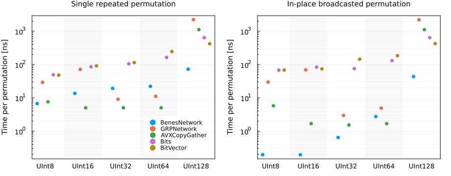

# BitPermutations.jl

[](https://github.com/giacomogiudice/BitPermutations.jl/actions?query=workflow%3ACI)
[](https://codecov.io/gh/giacomogiudice/BitPermutations.jl?token=G71Y9FQH6K)
[](https://github.com/invenia/BlueStyle)
[](https://github.com/JuliaTesting/Aqua.jl)
[](./LICENSE.md)

Efficient routines for repeated bit permutations.

## Introduction

Permutations of *n* bits can be performed in *O(log(n))* operations which reshuffle the individual bits in parallel.
To have each reshuffling layer efficient, they have to be chosen from sets of operations which are efficient on the CPU.
Precomputing these operations is slighly non-trivial, so this package may be useful only if you need to compute the application of a given permutation to a large number of words.

## Installation

<p>
    BitPermutations is a <a href="https://julialang.org">&nbsp;Julia Language</a> package.
    To install this package, please <a href="https://docs.julialang.org/en/v1/manual/getting-started/">open Julia's interactive session</a> (known as REPL) and press the <kbd>]</kbd> key in the REPL to use the package mode.
    Then type the following command
</p>

```
pkg> add BitPermutations
```

## Usage

To define a permutation of the bits in type `T`, construct a `BitPermutation{T}`.

Here is an example with `T = UInt8`.
Bits are ordered from LSB to MSB.

```julia
using BitPermutations

v = [2, 6, 5, 8, 4, 7, 1, 3]

p = BitPermutation{UInt8}(v)
```

we can then apply the permutation on any bitstring of type `UInt8` by using `bitpermute`.
If a functional approach is your jam, you can equivalently call the `BitPermutation` directly

```julia
x = 0x08          # 0 0 0 1 0 0 0 0 (LSB -> MSB)

bitpermute(x, p)  # 0 0 0 0 1 0 0 0, or 0x10

p(x)              # Idem
```

To inspect the result, we can use `bitstring`, or we can use a `Bits` (defined by the package).
It is basically a faster `BitVector` (defined in `Base`), since its size is fixed (but is mutable).

```julia
bits = Bits(x)

[bits[v], Bits(bitpermute(x, p))]
```

The neat thing of the underlying network is that the inverse permutation can be computed at the same cost.
This can be performed using `invbitpermute` or calling the adjoint permutation

```julia
invbitpermute(x, p) === p'(x)

[bits[invperm(v)], Bits(invbitpermute(x, p))]
```

Internally, a `Vector` of bit masks and shifts are stored and then applied sequentially at each call to `bitpermute`.
If you need to apply the permutation to an array of data, you can use the following syntax

```julia
xs = rand(T, 10)

p.(xs)                  # Regular permutation element-wise (also `bitpermute.(xs, p)`)

bitpermute(xs, p)       # Idem

bitpermute!(p, xs)      # Idem, but in-place

p'.(xs)                 # Inverse permutation element-wise (also `invbitpermute.(xs, p)`)

invbitpermute(xs, p)    # Idem

invbitpermute!(xs, p)   # Idem, but in-place
```

Internally, the broadcasted loop gets slices such that each stage is performed in parallel.
This leads to a significant performance increase.
As usual, if you do not need the original vector after the permutation step, the in-place version is faster, as it saves some allocations.

## Benchmarks

The functionalities mentioned above are best summarized in the plot below.
The results were obtained on an Intel Caskadelake processor running Julia 1.8.1 on a single thread.

<p align="center">
  
</p>

To accurately measure the repeatedly perform the same permutation `N` different times, similarly to

```julia
x = rand(T)

for _ in 1:N
    x = bitpermute(x, p)
end
```

while the broadcasted permutation is performed on an array in an element-wise fashion
```julia
xs = rand(T, N)

bitpermute!(p, xs)
```

In both cases we choose `N = 10_000`, and divide the median execution time by `N`.
Considering single permutations, Beneš networks are consistently faster than doing naïve permutations of `BitVector`s by a factor of 10, approximately.
As discussed later on, for types `UInt32` and `UInt64`, choosing a `GRPNetwork` can lead to significant speedups on processors which support BMI2 instructions.
Indeed, this leads to a speedup of around 20-30 compared to `BitVector`s, since it exploits advanced processor intrinsincs at each stage.
For other types however, the fallback implementation of these primitive operations is rather slow and should be avoided.

This benchmark was performed for random permutations, and is somewhat of a worst-case scenario, since each of these network has typically the most number of stages.
If your permutations are not completely random but have some structure, it is possible that you might achieve even larger speedups.

The most dramatic speedup are, however, for array-wise permutations.
In this case a `BenesNetwork` can permute bitstrings in a couple nanoseconds, yielding speedups of more than two orders of magnitude (more than 120 and 150 for `UInt32` and `UInt64`, respectively).
This is because the order of the operations is rearranged: the single layers of the network are not applied in sequence for each bit string, but are applied globally on each element.
This allows the processor to do the same operation over and over again, and potentially even use AVX instructions (although the same speedups are observed on Apple silicon).
It is unclear why the `GRPNetwork` is not faster than `BenesNetwork` for `UInt32` and `UInt64`  in this case, but I also do not know how to investigate this.
For `UInt128`, the bitstrings exceed the processor word size, and everything is a bit slower.
The speedup will also depend on the choice of `N`.
Your mileage may vary, especially depending on whether or not the array fits in cache. 

The full benchmark routine can be found in `benchmark/benchmarks.jl`, while the script for plotting the results is `benchmark/plot.jl`.


## Details

For a more in-depth explanation, the wonderful [https://programming.sirrida.de/bit_perm.html](https://programming.sirrida.de/bit_perm.html) is well worth reading.

Two different ways are performing the permutation are implemented: rearranged **Beneš networks** and **GRP networks**.
The latter is only faster on CPUs which support the [BMI2](https://en.wikipedia.org/wiki/X86_Bit_manipulation_instruction_set) instruction set.
Hence, the permutation is constructed using a `BenesNetwork{T}`, unless `T<:Union{UInt32,UInt64}` and BMI2 instructions are supported, in which case it uses a `GRPNetwork{T}`.
BMI2 intrinsics can be disabled by setting `ENV["BP_USE_BMI2"] = false` before loading the package or setting

```bash
export BP_USE_BMI2=false
```

before launching Julia.

### Beneš networks

A Beneš network is a series of **butterfly** or **delta-swap** operations, in which each node can be swapped or not with the corresponding node shifted by a fixed amount *δ*.
These operations are arranged in pairs, in a nested fashion, with the shifts chosen to be powers of two.

<p align="center">
  
</p>

Above is an example of a network with 8 nodes, with 3 different stages (pairs of reshuffling) which have as *δ* respectively 4, 2, 1.
The two innermost operations can always be fused into a single one.
Somewhat remarkably, in this way one can perform any arbitrary permutation.
It is also relatively efficient, as each delta-swap should take around 6 cycles on modern processors.
The construction of the masks for the swaps is explained in: Donald E. Knuth, *The Art of Computer Programming*, Vol. 4, Fascicle 1A, ([Addison-Wesley, Stanford, 2008](https://www-cs-faculty.stanford.edu/%7Eknuth/taocp.html)), available as pre-fascicle [here](http://www-cs-faculty.stanford.edu/%7Eknuth/fasc1a.ps.gz).
The general idea is to view each stage (pair of masks) as a repartition of the nodes into two sets.
We can then construct a graph in which each edge corresponds to the constraint of having two nodes in different partitions, both on the input and output side.
If we can 2-color the graph, we can then route each node to their corresponding partition, or color.
Fortunately, the graph is bipartite and it is very easy to do so: we iterate through the cycles of the graph and assign alternating colors to the nodes we visit.
One would wish to optimize the network in such a way that most masks are trivial (i. e. no swaps).
Unfortunately I do not know of any other way that exhaustively checking all possible *log(n)!* arrangements.
This can be disabled by passing the keyword argument `rearrage=false` to the constructor.

### GRP networks

GRP networks work in a similar way to Beneš network, except that each layer is a different reshuffling, known as *GRP* or [sheeps-and-goats](https://programming.sirrida.de/bit_perm.html#sag) (see also TAOCP).
GRP networks are typically shallower, but the reshuffling operation is only efficient if specific instructions are available in hardware, as they can be performed in 8 cycles.
The [PEXT/PDEP](https://www.chessprogramming.org/BMI2) instructions used for the GRP reshuffling is supported by Intel starting from the Haswell architecture (released in 2013) and by AMD from the Zen 3 architecture (released in 2020).
On older AMD architectures, PEXT/PDEP is implemented in microcode and are reportedly slower.
On such machines you may want to experiment which method is faster and possibly disable calls to BMI2 with `ENV["PB_USE_BMI2"] = false`.
Fallback operations are implemented but are typically much slower then butterfly operations.
The construction of the masks follows the algorithm in: R. Lee, Z. Shi, X. Yang, *Efficient permutation instructions for fast software cryptography*, [IEEE Micro](https://doi.org/10.1109/40.977759) (2001); which is well explained [here](https://programming.sirrida.de/bit_perm.html#lee_sag).

## Enhancements

Several improvements could be made.
Here I just list the first ones off the top of my head:

  - **Use ARM64-specific instructions** It would be nice to improve performance on ARM64 processors by exploiting intrinsics for these processors, specifically Apple silicon. In SVE there is some kind of `PEXT/PDEP` equivalent [here](https://developer.arm.com/architectures/instruction-sets/intrinsics/#f:@navigationhierarchiesinstructiongroup=[Bit%20manipulation]), as well as [GRP operations](https://developer.arm.com/documentation/ddi0602/2022-12/SVE-Instructions/BGRP--Group-bits-to-right-or-left-as-selected-by-bitmask-), but unfortunately they don't seem to be supported by Apple. There are also some interesting possibilities described [here](https://developer.arm.com/documentation/102159/0400/Permutation---Neon-instructions).
  - **Preconditioning** A simple way of reducing the depth of the network is to try cheap operations like `bitreverse` and `bitshift` before or after the network to try to save masks. This is what is done [here](https://programming.sirrida.de/calcperm.php).
  - **Lookup tables** Small permutations could benefit from doing sub-permutations with a precomputed table. One could use `pext` to extract say 8 bits at a time, look up their permutation in a table of 256 elements, and join the results with `|`. This approach is fast but scales linearly with size, both in time and space, so it is interesting for permutations on `UInt8`s, `UInt16`s and possibly `UInt32`s.
  - **PSHUFB** The [PSHUFB](https://www.chessprogramming.org/SSSE3#PSHUFB) instruction is part of SSE3 and can perform arbitrary byte reshufflings. It could be used to compress a bunch of layers or combined with lookup tables for some very promising speedups.
  - **Rearrangement** Finding the best possible arrangement of the stages of a Beneš network (such that the most masks are trivial) is currently done by exhaustive search. It is likely there is a better way of constructing the masks, but I am not aware of any.
  - **Better fallbacks** Faster software fallbacks for `pext/pdep` exist, ~~like [zp7](https://github.com/zwegner/zp7)~~ (uses x86 intrinsics anyway).
  - **Code refactoring** It should be possible to take a more functional approach and define a permutation as a series of transformations `T` ↦ `T`, but I'm not sure how to do that while preserving type inference and performance. This would allow for more generic algorithms and extensions.

## Compatibility

This package is compatible with Julia 1.5 and above.
